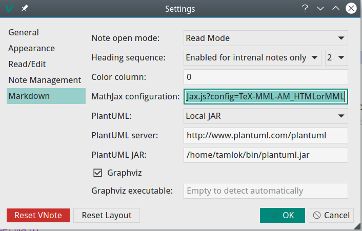
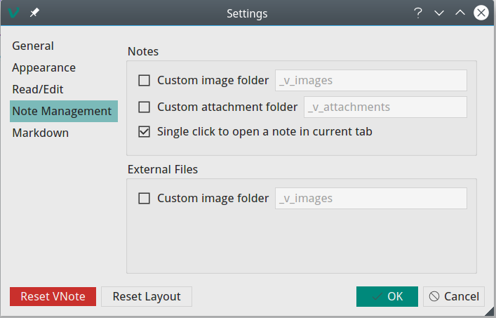

# 常见问题
## 如何指定自定义的MathJax脚本？
VNote支持配置`[web]/mathjax_javascript` ，它指定MathJax的位置及其使用的配置。默认值可能如下所示：

```ini
[web]
; Location and configuration for Mathjax
mathjax_javascript=https://cdnjs.cloudflare.com/ajax/libs/mathjax/2.7.2/MathJax.js?config=TeX-MML-AM_CHTML
```

您可以下载MathJax ([howto](http://docs.mathjax.org/en/latest/installation.html)) 并指定要使用的MathJax的本地副本，例如`mathjax_javascript="file:///home/tamlok/Downloads/MathJax-2.7.2/MathJax.js?config=TeX-MML-AM_CHTML"`。

您还可以在GUI设置对话框中指定自定义脚本：



注意：

- 请在本地路径前加上`file://`；
- 使用本地路径可能会无法找到字体。一个比较好的方法是在本机上运行一个轻量级的HTTP服务器。

## 如何让VNote更「便携」？
VNote将读取并存储配置文件到操作系统的公共目录中以存储应用程序数据。如果您希望将这些配置文件与VNote可执行文件一起放置，则可以在包含VNote可执行文件的目录中复制或创建`vnote.ini`文件。VNote将首先尝试从可执行文件所在的位置读取`vnote.ini`。

但请注意，VNote会将笔记本的路径存储在配置文件中，因此如果将VNote复制到另一台计算机，它可能会读取错误的路径并报错。

## 如何使用Mermaid或Flowchart.js绘制图表？
1. 在`Markdown`菜单中启用`Mermaid Diagram`和`Flowchart.js`；
2. 重新打开已打开的标签让它生效；
3. 对于Mermaid，用`mermaid`语言编写一个码块；
4. 对于Flowchart.js，用`flowchart` 或`flow`语言编写代码块；

Mermaid的例子：

```mermaid
graph TD;
A-->B;
A-->C;
B-->D;
C-->D;
```

Flowchart.js例子：

```flowchart
st=>start: Start:>http://www.google.com[blank]
e=>end:>http://www.google.com
op1=>operation: My Operation
sub1=>subroutine: My Subroutine
cond=>condition: Yes
or No?:>http://www.google.com
io=>inputoutput: catch something...

st->op1->cond
cond(yes)->io->e
cond(no)->sub1(right)->op1
```

## 如何在另一个标签中打开笔记？


当`单击在当前标签中打开该笔记`是可用的，在笔记列表中单击一个笔记本可以在当前的标签中打开，而双击笔记列表的笔记则在新标签中打开它。
