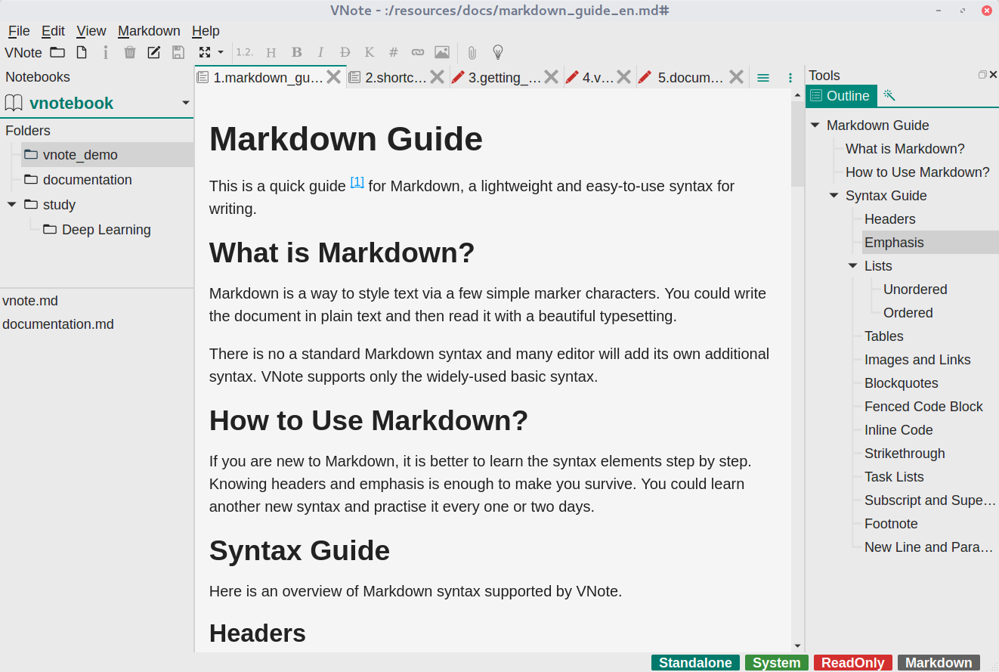

# 入门指南

VNote适用于在**Linux**，**Windows**和**macOS**系统。您可以从[下载](https://github.com/tamlok/vnote#downloads)页面获取独立软件包。

建议下载并使用VNote的**稳定版本**。如果您更喜欢使用VNote的一些最新功能，可以尝试从`master`分支产生的最新版本。

除了独立的安装包之外，一些包管理器可能已经打包和分发VNote，例如*AUR*和*homebrew cask*。

## 主界面

这是VNote主界面的截图。

 

### 菜单栏和工具栏

VNote通过窗口顶部的**菜单栏**提供一些设置，并通过菜单项或按钮上的菜单栏下方的**工具栏**提供一些方便的快捷键。将光标放在菜单栏选项或按钮出，会出现一个工具提示或状态提示，有助于说明该选项或按钮的功能。

### 笔记本，文件夹和笔记

VNote使用**Notebooks**、**Folders**和**Notes**层次结构进行笔记管理。左侧面板用于浏览笔记本，文件夹和笔记。

第一次启动VNote时，系统将提示您创建第一个笔记本。笔记本对应于文件系统中的目录。您应该选择一个空目录作为您的Notebook Root Folder。此笔记本的所有内容都将被存储在Notebook Root Folder中。

一旦你有了一个笔记本，你可以在这个笔记本中创建文件夹。VNote支持无限级别的文件夹。

左侧的面板的下部将列出当前文件夹中所有笔记。您可以在通过在该区域右侧菜单创建新的笔记。

### 内容区域

占据大部分空间的中间区域是**内容区域**，用于读取和编辑笔记。VNote支持通过选项卡打开多个笔记。

### 工具坞小部件。

在右侧面板中，有多个工具可以方便您进行阅读和编辑，例如**「大纲」**和**「片段」**。

### 准备好开始

这就是Vnote了！现在，您可以在VNote中阅读，编辑和管理您的笔记了！