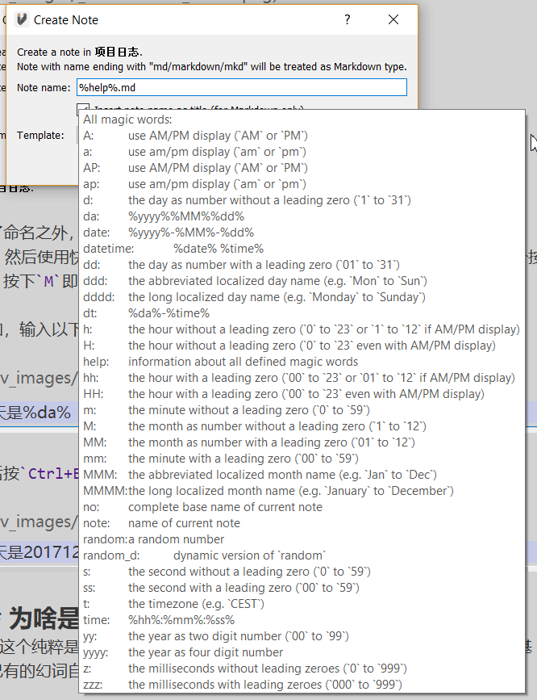
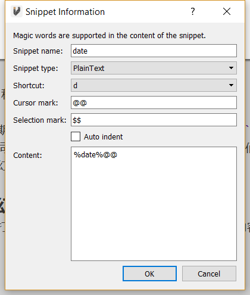

# Magic Word

**Magic Words**是一些具有特殊含义的字符。它们将被识别为一些预先定义好的字符。举一个简单的例子，`date`可以识别为今天的日期。

VNote在大多数输入窗口小部件中支持片段插入。例如，您可以在创建备注时插入片段作为备注名称。

`%da% work log.md`将识别为`20180128 work log.md` ，因为`%da%`是一个magic word，它以YYYYMMDD的形式定义为今天的日期。

在编辑器中，您可以键入 `%da%`，然后按快捷键 `Ctrl+E M`，它将光标下的单词识别为magic word。

例如，键入以下单词：

```
Today is %da%
```
然后按 `Ctrl+E M`，它将更改为：

```
Today is 20180128
```
## 内置Magic Words

VNote定义了许多Magic Words。在输入对话框中，键入`%help%` 以显示已定义的Magic Words列表。



 

## 自定义Magic Words

在配置文件夹中编辑 `vnote.ini` 文件，如下所示：

```ini
[magic_words]
1\name=vnote
1\definition="vnote is a great tool! -- Written %datetime%"
2\name=hw
2\definition="hello world!"
size=2
```
现在我们得到了两个Magic Words分别是：`vnote`（基于另一个Magic Words即`datetime`）和`hw`。

## 在片段中的Magic Words

[Snippet](snippet.html) 也支持magic word。现在我们可以定义一个片段来插入当前日期，如下所示：



 

现在处于编辑模式，我们可以按`Ctrl+E S D`来插入当前日期。