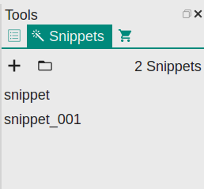

# 片段

片段旨在方便重复输入一些词组。

## 片段管理

您可以通过 `Tools` 工具栏小部件管理片段。



 

在此面板中，我们可以：

1. 创建一个片段；
2. 打开片段文件夹；

VNote使用配置文件夹中的一个文件夹来存储所有片段，并使用配置文件 `snippet.json` 进行管理。每个片段对应一个文件。

3. 查看和编辑有关片段的信息；

4.          排序和删除片段；
5.          将一个片段应用（插入）到编辑器中；

## 定义一个片段

片段包含：

- 片段名称
  - 用以标识不同的片段。它也是片段文件夹中相应文件的名称。

- 片段类型
  - 纯文本或HTML。目前仅支持纯文本。

- 快捷键
  - 您可以指定26个字符（a到z）中的一个来快速插入指定的片段。
- 光标标记
  - 插入片段后，VNote使用光标标记以表示光标的位置。应该只在内容中出现一次。
- 选择标记
  - 在应用片段之前，VNote使用选择标记以标记插入所选文本的位置。选择标记可能会在内容中多次出现。插入片段后，所有选择标记都将替换为所选片段。
- 内容
  - 在插入片段时，片段的内容将插入当前光标位置。

## 使用一个片段

### 片段面板

将光标放在正确的位置，然后双击代码段面板中的片段段以插入片段。

### 快捷键

您可以使用**Captain Mode**快速插入片段。在编辑模式下，按`Ctrl+E S` 以激活片段选择对话框，其中显示**已定义快捷方式**的所有片段。按相应的快捷键以插入片段。

## 例子

### 插入CPP语言的代码块

```cpp
@@
```
### 注释掉所选文本

```
<!-- $$@@ -->
```
### 颜色的标记

```
<font color=red>$$@@</font>
```
或：

```
<mark>$$@@</mark>
```
