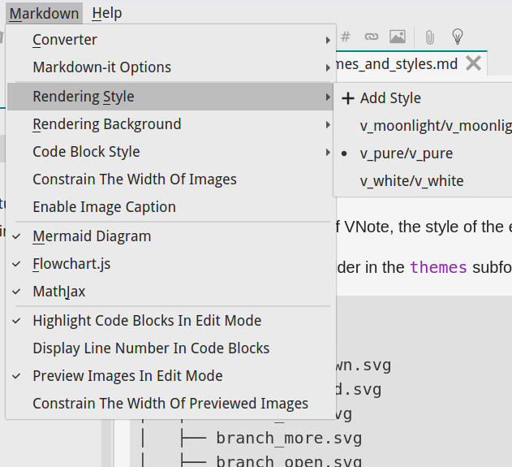

# 主题和风格

## 主题

**主题**用于指定VNote的外观，编辑器的样式和读取模式，以及代码块的语法高亮样式。

主题对应于配置文件夹中的`themes`文件夹中的子文件夹，其结构如下：

```
themes/
├── v_pure
│   ├── arrow_dropdown.svg
│   ├── branch_closed.svg
│   ├── branch_end.svg
│   ├── branch_more.svg
│   ├── branch_open.svg
│   ├── checkbox_checked.svg
│   ├── checkbox_unchecked.svg
│   ├── close_grey.svg
│   ├── close.svg
│   ├── down_disabled.svg
│   ├── down.svg
│   ├── float.svg
│   ├── left_disabled.svg
│   ├── left.svg
│   ├── line.svg
│   ├── menu_checkbox.svg
│   ├── menu_radiobutton.svg
│   ├── radiobutton_checked.svg
│   ├── radiobutton_unchecked.svg
│   ├── right_disabled.svg
│   ├── right.svg
│   ├── up_disabled.svg
│   ├── up.svg
│   ├── v_pure_codeblock.css
│   ├── v_pure.css
│   ├── v_pure.mdhl
│   ├── v_pure.palette
│   └── v_pure.qss
```
-  `v_pure.palette`：主题的主要条目，指定其他文件和样式；
-  `v_pure.qss`：[Qt样式表](http://doc.qt.io/qt-5/stylesheet-reference.html)的文件，它指定所有小部件的外观；
-  `v_pure.mdhl`：Markdown 编辑器风格的文件，使用[PEG Markdown的语法突出显示样式表](http://hasseg.org/peg-markdown-highlight/docs/stylesheet_syntax.html);
-  `v_pure.css`：文件的阅读模式；
-  `v_pure_codeblock.css`：使用Highlight.js[在读取模式下突出显示代码块样式的文件](https://highlightjs.org/static/demo/);

### 主题调色板

我们来看看`.palette`文件。该文件采用 `INI` 格式。

#### [metadata]

此部分指定该主题将使用的其他样式文件。

```ini
; File path could be absolute path or relative path (related to this file).
; Use @color_tag to reference a style.

[metadata]
qss_file=v_pure.qss
mdhl_file=v_pure.mdhl
css_file=v_pure.css
codeblock_css_file=v_pure_codeblock.css
version=2
```
#### [phony]

此部分用于定义基本抽象颜色属性的**变量**。变量可以通过@变量名引用并定义另一个变量。

这些变量由其他部分引用，因此您可以自由选择和定义自己的变量。

```ini
[phony]
; Abstract color attributes.
master_fg=#F5F5F5
master_bg=#00897B
master_light_bg=#80CBC4
master_dark_bg=#00796B
master_focus_bg=#009688
master_hover_bg=#009688
master_pressed_bg=#00796B

base_fg=#222222
base_bg=#EAEAEA

main_fg=@base_fg
main_bg=@base_bg

title_fg=@base_fg
title_bg=@base_bg

disabled_fg=#9E9E9E

content_fg=@base_fg
content_bg=@base_bg

border_bg=#D3D3D3

separator_bg=#D3D3D3

hover_fg=@base_fg
hover_bg=#D0D0D0

selected_fg=@base_fg
selected_bg=#BDBDBD

active_fg=@selected_fg
active_bg=@selected_bg

inactive_fg=@selected_fg
inactive_bg=#D3D3D3

focus_fg=@selected_fg
focus_bg=@selected_bg

pressed_fg=@base_fg
pressed_bg=#B2B2B2

edit_fg=#222222
edit_bg=#F5F5F5
edit_focus_bg=#E0F2F1
edit_focus_border=@master_bg
edit_selection_fg=@edit_fg
edit_selection_bg=@master_light_bg

icon_fg=#222222
icon_disabled_fg=@disabled_fg

danger_fg=#F5F5F5
danger_bg=#C9302C
danger_focus_bg=#D9534F
danger_hover_bg=#D9534F
danger_pressed_bg=#AC2925
```
#### [soft_defined]

本节定义Vnote代码所使用的变量。你**必须**定义这些变量才能使VNote看起来正确。

```ini
[soft_defined]
; VAvatar.
; The foreground color of the avatar when Captain mode is triggered.
avatar_captain_mode_fg=@master_fg
; The background color of the avatar when Captain mode is triggered.
avatar_captain_mode_bg=@master_bg

; Style of the label in Navigation mode.
navigation_label_fg=@master_fg
navigation_label_bg=@master_bg

; Style of the bubble of VButtonWithWidget.
bubble_fg=@master_fg
bubble_bg=@master_bg

; Icons' foreground.
danger_icon_fg=@danger_bg
item_icon_fg=@icon_fg
title_icon_fg=@icon_fg

; VVimIndicator.
vim_indicator_key_label_fg=@base_fg
vim_indicator_mode_label_fg=@base_fg
vim_indicator_cmd_edit_pending_bg=@selected_bg

; VTabIndicator.
tab_indicator_label_fg=@base_fg

; Html template.
template_title_flash_light_fg=@master_light_bg
template_title_flash_dark_fg=@master_bg

; Search hit items in list or tree view.
search_hit_item_fg=@selected_fg
search_hit_item_bg=@master_light_bg
```
#### [widgets]

本节定义了要在`qss`文件中使用的变量，以定义不同小部件的具体样式。它们被qss文件引用。

```ini
[widgets]
; Widget color attributes.

; QWidget.
widget_fg=@base_fg

; Separator of dock widgets.
dock_separator_bg=@border_bg
dock_separator_hover_bg=@border_bg

; Menubar.
menubar_bg=@main_bg
menubar_fg=@main_fg
menubar_item_selected_bg=@selected_bg

; Menu.
menu_bg=@base_bg
menu_fg=@base_fg
menu_item_disabled_fg=@disabled_fg
menu_item_selected_fg=@selected_fg
menu_item_selected_bg=@selected_bg
menu_separator_bg=@separator_bg
menu_icon_fg=@icon_fg
menu_icon_danger_fg=@danger_icon_fg
```
如果你好奇，`qss` 文件可能看起来像这样：
```css
/* QWidget */
QWidget
{
    color: @widget_fg;
    font-family: "Hiragino Sans GB", "冬青黑体", "Microsoft YaHei", "微软雅黑", "Microsoft YaHei UI", "WenQuanYi Micro Hei", "文泉驿雅黑", "Dengxian", "等线体", "STXihei", "华文细黑", "Liberation Sans", "Droid Sans", "NSimSun", "新宋体", "SimSun", "宋体", "Helvetica", "sans-serif", "Tahoma", "Arial", "Verdana", "Geneva", "Georgia", "Times New Roman";
}

QWidget[NotebookPanel="true"] {
    padding-left: 3px;
}
/* End QWidget */

/* QMainWindow */
QMainWindow {
    color: @base_fg;
    background: @base_bg;
}

QMainWindow::separator {
    background: @dock_separator_bg;
    width: 2px;
    height: 2px;
}

QMainWindow::separator:hover {
    background: @dock_separator_hover_bg;
}
/* End QMainWindow */

QMenuBar {
    border: none;
    background: @menubar_bg;
    color: @menubar_fg;
}

QMenuBar::item:selected {
    background: @menubar_item_selected_bg;
}
```

### 自定义主题

VNote支持自定义主题。只需将theme（文件夹）放在`themes`文件夹中，重新启动VNote并在菜单中的`File`中选择你的theme即可。

自定义主题的最佳方法是调整默认主题。VNote将在`themes` 文件夹中输出默认主题（如果没有，您可以在[此处](https://github.com/tamlok/vnote/tree/master/src/resources/themes)下载）。复制默认主题并重命名 `palette` 文件。然后你可以根据自己的喜好调整它。需要重新启动VNote才能使更改生效。

## 编辑风格

编辑器样式由`mdhl`文件指定。每个主题可能带有一个`mdhl`文件。您还可以应用另一个`mdhl`文件，而不是使用主题指定的默认文件。单独的样式文件可以放在配置文件夹的`styles` 文件夹中。为了扫描新的`mdhl`文件需要重新启动VNote，并且需要重新打开笔记以应用新样式。


 ### MDHL文件的语法

 `mdhl` 文件采用[PEG Markdown的语法高亮样式表](http://hasseg.org/peg-markdown-highlight/docs/stylesheet_syntax.html)并扩展它以支持更多元素。

```
# This is the default markdown styles used for Peg-Markdown-Highlight
# created by Le Tan(tamlokveer@gmail.com).
# For a complete description of the syntax, please refer to the original
# documentation of the style parser
# [The Syntax of PEG Markdown Highlight Stylesheets](http://hasseg.org/peg-markdown-highlight/docs/stylesheet_syntax.html).
# VNote adds some styles in the syntax which will be marked [VNote] in the comment.
#
# Note: Empty lines within a section is NOT allowed.
# Note: Do NOT modify this file directly. Copy it and tune your own style!

editor
# QTextEdit just choose the first available font, so specify the Chinese fonts first
# Do not use "" to quote the name
font-family: Hiragino Sans GB, 冬青黑体, Microsoft YaHei, 微软雅黑, Microsoft YaHei UI, WenQuanYi Micro Hei, 文泉驿雅黑, Dengxian, 等线体, STXihei, 华文细黑, Liberation Sans, Droid Sans, NSimSun, 新宋体, SimSun, 宋体, Helvetica, sans-serif, Tahoma, Arial, Verdana, Geneva, Georgia, Times New Roman
font-size: 12
foreground: 222222
background: f5f5f5
# [VNote] Style for trailing space
trailing-space: a8a8a8
# [VNote] Style for line number
line-number-background: eaeaea
line-number-foreground: 424242
# [VNote] Style for selected word highlight
selected-word-foreground: 222222
selected-word-background: dfdf00
# [VNote] Style for searched word highlight
searched-word-foreground: 222222
searched-word-background: 4db6ac
# [VNote] Style for searched word under cursor highlight
searched-word-cursor-foreground: 222222
searched-word-cursor-background: 66bb6a
# [VNote] Style for incremental searched word highlight
incremental-searched-word-foreground: 222222
incremental-searched-word-background: ce93d8
# [VNote] Style for color column in fenced code block
color-column-background: dd0000
color-column-foreground: ffff00
# [VNote} Style for preview image line
preview-image-line-foreground: 9575cd

editor-selection
foreground: eeeeee
background: 005fff

editor-current-line
background: c5cae9
# [VNote] Vim insert mode cursor line background
vim-insert-background: c5cae9
# [VNote] Vim normal mode cursor line background
vim-normal-background: e0e0e0
# [VNote] Vim visual mode cursor line background
vim-visual-background: bbdefb
# [VNote] Vim replace mode cursor line background
vim-replace-background: f8bbd0

H1
foreground: 222222
font-style: bold
font-size: +8

VERBATIM
foreground: 673ab7
font-family: Consolas, Monaco, Andale Mono, Monospace, Courier New
# [VNote] Codeblock sylte from HighlightJS (bold, italic, underlined, color)
# The last occurence of the same attribute takes effect
# Could specify multiple attribute in one line
hljs-comment: 6c6c6c
hljs-keyword: 0000ee
hljs-attribute: 0000ee
hljs-selector-tag: 0000ee
hljs-meta-keyword: 0000ee
hljs-doctag: 0000ee
hljs-name: 0000ee
hljs-type: 880000
hljs-string: 880000
hljs-number: 880000
hljs-selector-id: 880000
hljs-selector-class: 880000
hljs-quote: 880000
hljs-template-tag: 880000
hljs-deletion: 880000
hljs-title: bold, 880000
hljs-section: bold, 880000
hljs-regexp: bc6060
hljs-symbol: bc6060
hljs-variable: bc6060
hljs-template-variable: bc6060
hljs-link: bc6060
hljs-selector-attr: bc6060
hljs-selector-pseudo: bc6060
hljs-literal: af00d7
hljs-built_in: 008700
hljs-bullet: 008700
hljs-code: 008700
hljs-addition: 008700
hljs-meta: 1f7199
hljs-meta-string: 4d99bf
hljs-emphasis: italic
hljs-strong: bold
```

The syntax highlight of the code blocks in edit mode is specified by the `VERBATIM` element.

For example, if you want to change the font size of the code block in edit mode, you may need to add the following line under `VERBATIM` element:

```
font-size: -2
```
## 渲染样式

读取模式下的呈现样式由`css`文件指定。每个主题都可以带有一个`css`文件。您还可以应用另一个`css`文件，而不是使用主题指定的默认文件。单独的样式文件可以放在配置文件夹的 `styles`文件夹中。为了扫描新的css文件需要重新启动`css`，并且需要重新打开笔记以应用新样式。



 

## 代码块渲染样式

读取模式下的呈现样式由`css` 文件指定。每个主题都可以带有一个`css` 文件。您还可以应用另一个`css` 文件，而不是使用主题指定的默认文件。单独的样式文件可以放在配置文件夹的`styles/codeblock_styles` 文件夹中。为了扫描新的`css` 文件需要重新启动VNote，并且需要重新打开注释笔记以应用新样式。

该文件由 **highlight.js** 渲染器引擎使用。您可以从[Highlight.js Github](https://github.com/isagalaev/highlight.js/tree/master/src/styles)下载现有的样式文件。